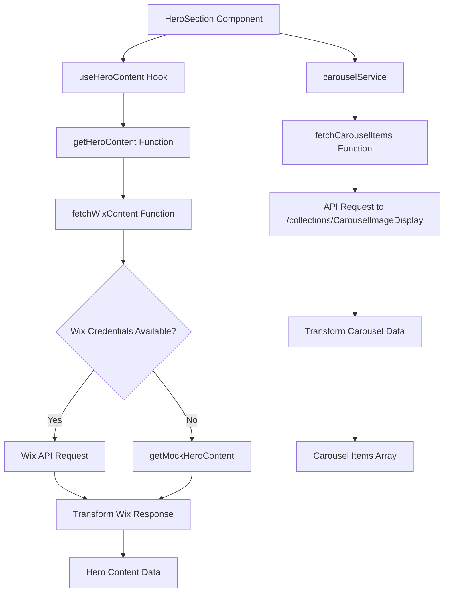

# HeroSection Component Implementation Guide

This document provides comprehensive guidelines for implementing and maintaining the HeroSection component in the AgroVentia Inc. website.

## Overview

The HeroSection is the primary landing section of the homepage that showcases key messaging, calls-to-action, and a dynamic background carousel. It integrates with Wix CMS to fetch content dynamically while providing fallback mechanisms for development and error scenarios.

## Component Structure

The HeroSection component is located at:

```
src/components/sections/HeroSection.tsx
```

### Key Features

1. **Dynamic Content Integration**
   - Fetches content from Wix CMS collections
   - Displays fallback content when CMS data is unavailable
   - Supports both HeroContent and CarouselImageDisplay collections

2. **Background Carousel**
   - Implements an image carousel with parallax effect
   - Automatically rotates images every 7 seconds
   - Smooth opacity transitions (2000ms) between images

3. **Call-to-Action Buttons**
   - Primary and secondary CTA buttons with glassmorphic styling
   - Navigation functionality to other sections of the page
   - Dynamic text from CMS with fallback values

## Data Integration

### CMS Collections

The HeroSection integrates with two Wix CMS collections:

#### 1. HeroContent Collection

Contains static hero content including:

- `title`: Main heading text
- `subtitle`: Supporting text below the heading
- `description`: Additional descriptive content
- `backgroundImage`: Fallback background image
- `ctaPrimary`: Text for the primary CTA button
- `ctaSecondary`: Text for the secondary CTA button

**Fallback Values:**

- Title: "Premium Agricultural Imports from West Africa"
- Subtitle: "Connecting Global Markets with Quality Agricultural Products"
- Primary CTA: "Explore Products"
- Secondary CTA: "Contact Us"

#### 2. CarouselImageDisplay Collection

Contains dynamic carousel content including:

- `imageUrl`: Background image for each slide
- `title`: Heading text for each slide
- `tagline`: Supporting text for each slide
- `description`: Additional descriptive content
- `displayOrder`: Order in which slides should appear

### Data Fetching Flow



## Implementation Details

### Component Dependencies

The HeroSection relies on several key dependencies:

1. **React Hooks**
   - `useState`: For managing carousel state
   - `useEffect`: For side effects and lifecycle management
   - `useRef`: For DOM references

2. **Custom Hooks**
   - `useHeroContent`: Fetches hero content from Wix CMS
   - Custom hooks for carousel functionality

3. **UI Components**
   - `Button`: For CTA buttons with variants
   - `WixImage`: For optimized image handling
   - `LoadingSpinner`: For loading states

4. **Services**
   - `carouselService`: Manages carousel data fetching
   - Wix data services for content integration

### Styling and Animation

The HeroSection implements several visual enhancements:

1. **Glassmorphic Design**
   - Secondary CTA button uses glass variant
   - Backdrop blur effects for depth
   - Semi-transparent borders

2. **Parallax Effect**
   - Background image moves at a different speed than scroll
   - Implemented with scroll event listeners
   - Smooth transformation based on scroll position

3. **Carousel Transitions**
   - 2000ms opacity transitions between images
   - 7000ms display intervals for each slide
   - Z-index management for proper layering

4. **Responsive Design**
   - Flexbox layout for content positioning
   - Media queries for different screen sizes
   - Relative sizing with clamp() for fluid typography

### Error Handling

The component implements comprehensive error handling:

1. **Loading States**
   - Displays loading spinner while fetching data
   - Separate loading states for hero content and carousel

2. **Error States**
   - Console logging for debugging
   - Fallback to mock data in development
   - Graceful degradation to static content

3. **Empty States**
   - Fallback to static background gradient
   - Default content when CMS data is unavailable

## Usage Guidelines

### Adding New Carousel Items

To add new carousel items:

1. Add entries to the Wix CMS CarouselImageDisplay collection
2. Ensure all required fields are populated:
   - `imageUrl`: Valid image URL
   - `title`: Descriptive heading
   - `tagline`: Supporting text
   - `displayOrder`: Sequential numbering

### Updating Hero Content

To update static hero content:

1. Modify entries in the Wix CMS HeroContent collection
2. Update the following fields as needed:
   - `title`: Main heading
   - `subtitle`: Supporting text
   - `ctaPrimary`: Primary button text
   - `ctaSecondary`: Secondary button text

### Styling Modifications

When modifying styles:

1. Maintain the glassmorphic design principles
2. Ensure proper contrast for text readability
3. Preserve animation timing preferences (2000ms transitions, 7000ms intervals)
4. Test across different screen sizes

## Testing

### Unit Tests

The HeroSection should be tested for:

1. Data fetching scenarios
   - Successful data retrieval
   - Error handling
   - Loading states
   - Fallback content display

2. UI Interactions
   - Button click handlers
   - Navigation functionality
   - Carousel rotation

3. Responsive Behavior
   - Different screen sizes
   - Mobile vs desktop layouts

### Integration Tests

1. Wix CMS Integration
   - Verify data mapping
   - Test with actual CMS data
   - Validate fallback mechanisms

2. Carousel Functionality
   - Image rotation timing
   - Transition smoothness
   - Parallax effect

## Performance Considerations

1. **Image Optimization**
   - Use WixImage component for proper optimization
   - Lazy loading for off-screen images
   - Appropriate sizing for different viewports

2. **Animation Performance**
   - Use CSS transitions instead of JavaScript where possible
   - Optimize scroll event listeners with throttling
   - Minimize re-renders with proper state management

3. **Data Fetching**
   - Implement caching with React Query
   - Set appropriate stale time (5 minutes)
   - Use garbage collection time (10 minutes)

## Troubleshooting

### Common Issues

1. **CTA Buttons Showing Fallback Text**
   - Check Wix CMS HeroContent collection for proper field values
   - Verify environment variables are configured
   - Check browser console for data fetching errors

2. **Carousel Not Displaying**
   - Verify CarouselImageDisplay collection has items
   - Check API endpoint responses
   - Confirm image URLs are valid

3. **Styling Issues**
   - Ensure CSS variables are properly defined
   - Check for conflicting styles
   - Verify Tailwind classes are correctly applied

### Debugging Steps

1. Check browser console for errors
2. Inspect network tab for failed API requests
3. Verify Wix CMS collection structure matches expected format
4. Confirm environment variables are properly configured

## Maintenance

### Updating Dependencies

When updating dependencies:

1. Test data fetching functionality
2. Verify animation performance
3. Check responsive behavior
4. Validate error handling

### Adding New Features

When extending the HeroSection:

1. Maintain existing design principles
2. Follow established data fetching patterns
3. Implement proper error handling
4. Update documentation accordingly

## Related Files

- `src/components/sections/HeroSection.tsx`: Main component implementation
- `src/hooks/useWixContent.ts`: Custom hook for Wix content
- `src/services/carousel.service.ts`: Carousel data service
- `src/lib/api/wix-client.ts`: Wix API client
- `src/types/wix.ts`: TypeScript interfaces
- `src/lib/api/mock-data.ts`: Mock data for development

## Version History

- v1.0: Initial implementation with Wix CMS integration
- v1.1: Added glassmorphic design for CTA buttons
- v1.2: Improved error handling and fallback mechanisms
- v1.3: Enhanced documentation and testing guidelines
