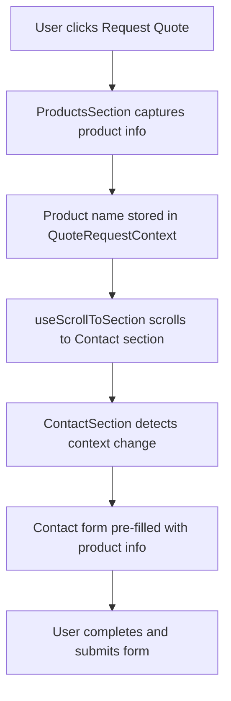

# Product Quote Request Flow Documentation

## Overview

This document provides a comprehensive overview of the product quote request functionality implemented in the AgroVentia website. It explains how users can request quotes for products and how the system handles these requests from start to finish.

## User Journey

1. **Product Discovery**: User browses products in the Products section
2. **Quote Request**: User clicks "Request Quote" button on a product card
3. **Navigation**: User is automatically scrolled to the Contact section
4. **Form Pre-fill**: Contact form is pre-filled with product information
5. **Form Completion**: User completes remaining form fields
6. **Submission**: User submits the form to request a quote

## Technical Implementation

### Components

The functionality is implemented using three main technical components:

1. **[QuoteRequestContext](file:///c:/Users/user/Desktop/work/Projects/Clients/AgroVentia%20Inc/AVI-inc/agroventia-homepage/src/contexts/QuoteRequestContext.tsx)**: Manages state sharing between distant components
2. **[useScrollToSection Hook](file:///c:/Users/user/Desktop/work/Projects/Clients/AgroVentia%20Inc/AVI-inc/agroventia-homepage/src/hooks/useScrollToSection.ts)**: Provides smooth scrolling to page sections
3. **Integration in [ProductsSection](file:///c:/Users/user/Desktop/work/Projects/Clients/AgroVentia%20Inc/AVI-inc/agroventia-homepage/src/components/sections/ProductsSection.tsx) and [ContactSection](file:///c:/Users/user/Desktop/work/Projects/Clients/AgroVentia%20Inc/AVI-inc/agroventia-homepage/src/components/sections/ContactSection.tsx)**: Components that consume and interact with the functionality

### Data Flow



### File Structure

```
src/
├── contexts/
│   └── QuoteRequestContext.tsx
├── hooks/
│   └── useScrollToSection.ts
├── components/
│   ├── sections/
│   │   ├── ProductsSection.tsx
│   │   └── ContactSection.tsx
└── docs/
    ├── QuoteRequestContext.md
    ├── useScrollToSectionHook.md
    ├── QuoteRequestFunctionality.md
    └── ProductQuoteRequestFlow.md
```

## Integration Points

### 1. Main Page Integration

The `QuoteRequestProvider` wraps the main content in `page.tsx`:

```typescript
<main>
  <QuoteRequestProvider>
    <HeroSection />
    <AboutSection />
    <ServicesSection />
    <ProductsSection />
    <ContactSection />
  </QuoteRequestProvider>
</main>
```

### 2. Products Section Integration

The [ProductsSection](file:///c:/Users/user/Desktop/work/Projects/Clients/AgroVentia%20Inc/AVI-inc/agroventia-homepage/src/components/sections/ProductsSection.tsx) component:

- Imports and uses the `useQuoteRequest` hook
- Imports and uses the `useScrollToSection` hook
- Handles button clicks with the `handleRequestQuote` function

### 3. Contact Section Integration

The [ContactSection](file:///c:/Users/user/Desktop/work/Projects/Clients/AgroVentia%20Inc/AVI-inc/agroventia-homepage/src/components/sections/ContactSection.tsx) component:

- Imports and uses the `useQuoteRequest` hook
- Uses a `useEffect` hook to detect changes in the requested product
- Automatically updates form fields when a product is requested

## Key Features

### Smooth Scrolling

Users are smoothly scrolled to the contact form with an appropriate offset to ensure the form is visible and properly positioned.

### Form Pre-filling

The contact form is automatically pre-filled with:

- Enquiry type set to "Request a Quote"
- Message field containing the product name

### State Management

The solution uses React Context API for efficient state management without prop drilling.

### Error Handling

The implementation gracefully handles cases where:

- Context is used outside of a provider
- Target elements for scrolling don't exist
- Product information is not available

## Customization Options

### Adjusting Scroll Offset

The scroll offset can be adjusted in the `handleRequestQuote` function:

```typescript
// Current implementation
scrollToSection('contact', 100);

// To change offset to 50px
scrollToSection('contact', 50);
```

### Modifying Pre-filled Message

The pre-filled message in [ContactSection.tsx](file:///c:/Users/user/Desktop/work/Projects/Clients/AgroVentia%20Inc/AVI-inc/agroventia-homepage/src/components/sections/ContactSection.tsx) can be customized:

```typescript
message: `I'm interested in ${requestedProduct}. Please provide a quote.\n\n`,
```

### Adding More Product Information

Additional product information can be passed through the context by modifying the context interface:

```typescript
interface QuoteRequestContextType {
  requestedProduct: {
    name: string;
    id: string;
    price?: number;
  } | null;
  setRequestedProduct: (
    product: { name: string; id: string; price?: number } | null
  ) => void;
}
```

## Testing

### Manual Testing

1. Navigate to the Products section
2. Click "Request Quote" on any product card
3. Verify that:
   - The page scrolls to the Contact section
   - The enquiry type is set to "Request a Quote"
   - The message field contains the product name
   - Other form fields remain empty for user input

### Automated Testing

Components can be tested using:

- React Testing Library for component testing
- Jest for unit testing context and hook functionality

## Performance Considerations

1. **Minimal Re-renders**: The context only updates when a quote is requested
2. **Efficient Scrolling**: Uses native browser smooth scrolling
3. **Memory Management**: Context state is cleared after use

## Accessibility

The implementation maintains standard form accessibility while enhancing user experience:

- All form fields remain accessible to screen readers
- Keyboard navigation is preserved
- Focus management follows standard patterns

## Troubleshooting

### Common Issues

1. **Scrolling Not Working**
   - Verify the target section has the correct ID
   - Check browser console for JavaScript errors

2. **Form Not Pre-filling**
   - Ensure the `QuoteRequestProvider` wraps both sections
   - Check browser console for context-related errors

3. **Context Errors**
   - Verify `useQuoteRequest` is used within a `QuoteRequestProvider`
   - Check for proper import statements

### Debugging Tips

1. Use React DevTools to inspect context values
2. Add console.log statements to track data flow
3. Verify component hierarchy in browser dev tools

## Future Enhancements

1. **Enhanced Product Information**: Pass more detailed product data (SKU, price, etc.)
2. **Analytics Integration**: Track quote request events
3. **Form Validation**: Add validation for pre-filled data
4. **Persistence**: Store quote requests in localStorage
5. **Multi-step Forms**: Implement multi-step quote request process
